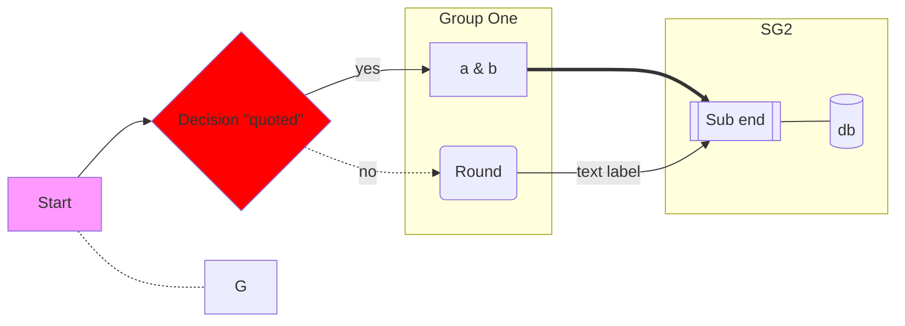

# Mermaid headless-in-Node verification lab — ground truth (2026-08-23)

Everything below was actually executed in this directory
(`/tmp/claude-0/-home-user-Thalyx/3bad5ff7-67a8-5ccd-8261-d90eb98fb882/scratchpad/mermaid-lab`)
on **Node v22.22.2**, package.json `"type": "module"`. All output dumps are real, unedited program output
(`out-0N.txt` files sit next to the scripts).

## Exact versions & licenses (installed today via `npm install`)

| package | version | license |
|---|---|---|
| `mermaid` | **11.17.0** | MIT |
| `jsdom` | 30.0.1 | MIT |
| `@mermaid-js/parser` | **1.2.1** | MIT |
| `dompurify` (transitive dep of mermaid) | 3.4.14 | MPL-2.0 OR Apache-2.0 (dual; Apache-2.0 usable) |

All permissively licensed → OK for a public-domain project.

---

## VERDICT (one paragraph)

`mermaid.parse()` **and** `mermaid.mermaidAPI.getDiagramFromText()` run headless in Node, and
`getDiagramFromText(...).db` exposes the full logical graph (nodes, edges, subgraphs, direction,
classes, styles, tooltips, links) with stable property names — **this is the viable import path**.
Two mandatory workarounds: (1) install **jsdom `window`/`document` globals BEFORE importing mermaid**
(dompurify captures `globalThis.window` at module-eval time and otherwise returns a crippled stub —
any diagram containing a *labeled* node/edge then throws `DOMPurify.addHook is not a function`);
(2) call `await mermaid.parse(text)` once before `mermaid.mermaidAPI.getDiagramFromText(text)`
(otherwise `UnknownDiagramError: No diagram type detected` because lazy diagram detectors are only
registered by the parse/render pipeline). `@mermaid-js/parser` (the new langium parser) is **NOT** a
fallback for the core diagrams: v1.2.1 has **no flowchart/sequence/state/class grammars** at all.
Bonus: `mermaid.render()` also works headless under jsdom with 3 small extra shims (structurally valid
SVG; text metrics are stubbed so widths are approximate).

---

## 1. Headless `mermaid.parse()` — works, with a sharp edge

### 1a. Bare Node, NO jsdom, unlabeled diagram → works

`01-bare-import.mjs`:
```js
const mermaid = (await import('mermaid')).default;
const r = await mermaid.parse('flowchart TD\n A --> B');
// → {"diagramType":"flowchart-v2","config":{}}
```
Real output: `PARSE OK: {"diagramType":"flowchart-v2","config":{}}`

### 1b. Bare Node, NO jsdom, diagram with ANY labeled node → FAILS

```
Error: DOMPurify.addHook is not a function          // securityLevel strict (default)
Error: DOMPurify.sanitize is not a function         // securityLevel 'loose' — NO escape hatch
```
Root cause (verified in `node_modules/dompurify/dist/purify.es.mjs` line ~475):
```js
if (!window || !window.document || ...) {
  DOMPurify.isSupported = false;
  return DOMPurify;   // stub without .sanitize/.addHook
}
```
and mermaid's `src/diagrams/common/common.ts` (`chunk-DU6HZSFF.mjs`) calls
`DOMPurify.sanitize(...)` inside `sanitizeText()` **unconditionally** (even at
securityLevel `loose`), and `DOMPurify.addHook` at `strict`. `FlowDB.addVertex`
calls `sanitizeText` only when a vertex/edge has label text — which is why bare
`A --> B` sneaks through but anything real does not.

**Conclusion: jsdom globals are mandatory for real-world input. There is no config-only workaround.**

### 1c. The canonical shim (works for everything below)

`setup-dom.mjs` — must run BEFORE `import('mermaid')` (use dynamic import ordering; a static
`import mermaid from 'mermaid'` in the same file is hoisted above the shim and fails):
```js
import { JSDOM } from 'jsdom';
const dom = new JSDOM('<!DOCTYPE html><html><body></body></html>', { url: 'https://localhost/' });
globalThis.window = dom.window;
globalThis.document = dom.window.document;
```
Then:
```js
await import('./setup-dom.mjs');
const mermaid = (await import('mermaid')).default;
```
No other globals needed for parse/db extraction. (Node 22 already has `navigator`; not needed anyway.)

### 1d. Second mandatory workaround: parse before getDiagramFromText

Calling `mermaid.mermaidAPI.getDiagramFromText(text)` as the FIRST mermaid call throws (verbatim):
```
UnknownDiagramError: No diagram type detected matching given configuration for text: flowchart LR ...
    at detectType (.../chunk-DU6HZSFF.mjs:5034:9)
    at Diagram.fromText (.../mermaid.core.mjs:922:18)
    at Object.getDiagramFromText (.../mermaid.core.mjs:1406:18)
```
Reason: flowchart & friends are lazy-loaded; their detectors register during the
`mermaid.parse()`/`render()` pipeline. Fix:
```js
await mermaid.parse(text);                                    // registers + loads detectors
const diagram = await mermaid.mermaidAPI.getDiagramFromText(text);
```
(`mermaid.parse` itself does full parsing and validation; `getDiagramFromText` re-parses and hands
back `{ type, db, parser, renderer }`.)

---

## 2. Flowchart: full db dump (THE import surface)

Input used (note: `#quot;` is how mermaid escapes a double quote inside a quoted label —
a raw `"` inside `{...}` is a **parse error**, verified: `Expecting 'SQE', ... got 'STR'`):



`diagram.type` = `"flowchart-v2"`, `diagram.db.constructor.name` = `"FlowDB"`.

FlowDB methods (verified full list): `addClass, addLink, addNodeFromVertex, addSingleLink,
addSubGraph, addVertex, bindFunctions, clear, destructLink, getClasses, getData, getDirection,
getEdges, getSubGraphs, getTooltip, getVertices, lookUpDomId, setClickEvent, setDirection, setLink,
setTooltip, updateLink, updateLinkInterpolate, ...` (plus internals).

### 2a. `db.getDirection()` → `"LR"` (plain string; `"TB"|"TD"|"BT"|"RL"|"LR"`)

### 2b. `db.getVertices()` → **a `Map<string, FlowVertex>`** (NOT a plain object — use `Object.fromEntries()` / `.entries()`)

Real dump (abridged only by removing repeats; property names exact):
```json
{
  "A": {
    "id": "A",
    "labelType": "text",
    "domId": "flowchart-A-0",
    "styles": ["fill:#f9f"],
    "classes": ["clickable"],
    "text": "Start",
    "type": "square",
    "props": {},
    "link": "https://example.com/"
  },
  "B": {
    "id": "B",
    "labelType": "string",
    "domId": "flowchart-B-1",
    "styles": [],
    "classes": ["red"],
    "text": "Decision fl°quot¶ßquotedfl°quot¶ß",
    "type": "diamond",
    "props": {}
  },
  "C": { "id": "C", "labelType": "string", "text": "a & b", "type": "square", ... },
  "D": { "id": "D", "labelType": "text",   "text": "Round", "type": "round", ... },
  "E": { "id": "E", "labelType": "text",   "text": "Sub end", "type": "subroutine", ... },
  "F": { "id": "F", "labelType": "text",   "text": "db", "type": "cylinder", ... },
  "G": { "id": "G", "labelType": "text",   "text": "G", "props": {} }   // NOTE: no "type" key for bare nodes
}
```
Key facts:
- Label property is **`text`** (not `label`); `labelType` is `"text" | "string"` (`"string"` when the
  label was written in quotes; also `"markdown"` for `"\`...\`"` markdown strings).
- Shape property is **`type`**: `"square"` (`[..]`), `"round"` (`(..)`), `"diamond"` (`{..}`),
  `"subroutine"` (`[[..]]`), `"cylinder"` (`[(..)]`), `"stadium"`, `"circle"`, `"doublecircle"`,
  `"hexagon"`, `"lean_right"`, `"lean_left"`, `"trapezoid"`, `"inv_trapezoid"`, `"odd"` … and
  **absent entirely** for a bare node with no shape brackets.
- `"a & b"` comes back with a literal `&` — safe.
- **GOTCHA — entity placeholders:** `#quot;` in source becomes `fl°quot¶ß` (U+FB02 U+00B0 …
  U+00B6 U+00DF) in `text`. This is mermaid's internal `encodeEntities` placeholder applied by the
  render/parse pipeline. Decode for import with the inverse of mermaid's own `decodeEntities`
  (verbatim from `chunk-75Z2AOVW.mjs:541`):
  ```js
  text.replace(/fl°°/g, "&#").replace(/fl°/g, "&").replace(/¶ß/g, ";")   // → "&quot;" etc.
  ```
  then HTML-entity-decode to get the plain character.
- `link` (from `click A "url"`) is present on the vertex; `db.getTooltip('A')` → `"tooltip"`.

### 2c. `db.getEdges()` → plain **Array** of edge objects

Real dump (all six edges from the sample; property names exact):
```json
[
  { "start": "A", "end": "B", "type": "arrow_point", "text": "",           "labelType": "text", "classes": [], "isUserDefinedId": false, "stroke": "normal", "length": 1, "id": "L_A_B_0" },
  { "start": "B", "end": "C", "type": "arrow_point", "text": "yes",        "labelType": "text", "classes": [], "isUserDefinedId": false, "stroke": "normal", "length": 1, "id": "L_B_C_0" },
  { "start": "B", "end": "D", "type": "arrow_point", "text": "no",         "labelType": "text", "classes": [], "isUserDefinedId": false, "stroke": "dotted", "length": 1, "id": "L_B_D_0" },
  { "start": "C", "end": "E", "type": "arrow_point", "text": "",           "labelType": "text", "classes": [], "isUserDefinedId": false, "stroke": "thick",  "length": 1, "id": "L_C_E_0" },
  { "start": "D", "end": "E", "type": "arrow_point", "text": "text label", "labelType": "text", "classes": [], "isUserDefinedId": false, "stroke": "normal", "length": 1, "id": "L_D_E_0" },
  { "start": "E", "end": "F", "type": "arrow_open",  "text": "",           "labelType": "text", "classes": [], "isUserDefinedId": false, "stroke": "normal", "length": 1, "id": "L_E_F_0" },
  { "start": "A", "end": "G", "type": "arrow_open",  "text": "",           "labelType": "text", "classes": [], "isUserDefinedId": false, "stroke": "dotted", "length": 1, "id": "L_A_G_0" }
]
```

**Complete arrow-syntax → (type, stroke, length) mapping** (all verified in `04-arrow-types.mjs`):

| mermaid syntax | `type` | `stroke` | `length` |
|---|---|---|---|
| `-->` | `arrow_point` | `normal` | 1 |
| `---` | `arrow_open` | `normal` | 1 |
| `-.-` / `-.->` | `arrow_open` / `arrow_point` | `dotted` | 1 |
| `==>` | `arrow_point` | `thick` | 1 |
| `--o` | `arrow_circle` | `normal` | 1 |
| `--x` | `arrow_cross` | `normal` | 1 |
| `<-->` | `double_arrow_point` | `normal` | 1 |
| `o--o` | `double_arrow_circle` | `normal` | 1 |
| `x--x` | `double_arrow_cross` | `normal` | 1 |
| `~~~` (invisible) | `arrow_open` | `invisible` | 1 |
| `---->` (extra dashes) | `arrow_point` | `normal` | **3** (length = dash count − 1) |
| `-..->` | `arrow_point` | `dotted` | 2 |
| `<==>` | `double_arrow_point` | `thick` | 1 |
| `A e1@--> B` (edge id, v11.6+) | `arrow_point` | `normal` | 1, `id: "e1"`, `isUserDefinedId: true` |

Edge `text` carries the label from `-->|lbl|` or `--lbl-->` equally. Auto ids are `L_<start>_<end>_<n>`.
Gotcha: `e1@--> B` without a source node is a parse error (`got 'LINK_ID'`) — the `id@` prefix goes
between source node and the arrow.

### 2d. `db.getSubGraphs()` → Array (order = declaration order)

```json
[
  { "id": "SG1", "nodes": ["C", "D"], "title": "Group One", "classes": [], "labelType": "text" },
  { "id": "SG2", "nodes": ["E", "F"], "title": "SG2", "classes": [], "dir": "TB", "labelType": "text" }
]
```
- `title` falls back to the id when no `[...]` title given; `dir` present only if
  `direction` was declared inside the subgraph. Nested subgraphs: inner subgraph id appears in the
  outer's `nodes` array.

### 2e. `db.getClasses()` → Map of classDefs
```json
{ "red": { "id": "red", "styles": ["fill:#f00"], "textStyles": [] } }
```

### 2f. `db.getData()` — the "layout-ready" alternative surface (mermaid v11 unified rendering)

`db.getData()` returns `{ nodes, edges, other, config }` — the pre-processed structures mermaid's own
layout consumes. Useful for high-fidelity import (resolved shape names + arrowheads per endpoint):
```json
// nodes[0]
{ "id": "A", "label": "A", "labelType": "text", "labelStyle": "", "padding": 15,
  "cssStyles": [], "cssCompiledStyles": [], "cssClasses": "default ", "domId": "flowchart-A-0",
  "look": "classic", "isGroup": false, "shape": "squareRect" }
// edges[0]
{ "id": "L_A_B_0", "isUserDefinedId": false, "start": "A", "end": "B", "type": "arrow_circle",
  "label": "", "labelType": "text", "labelpos": "c", "thickness": "normal", "minlen": 1,
  "classes": "edge-thickness-normal edge-pattern-solid flowchart-link",
  "arrowTypeStart": "none", "arrowTypeEnd": "arrow_circle", "arrowheadStyle": "fill: #333",
  "cssCompiledStyles": [], "labelStyle": [], "style": [], "pattern": "normal",
  "look": "classic", "curve": "basis" }
```
Note `getData()` node key is `label` here (vs `text` on `getVertices()`), shape is `shape`
(`"squareRect"`, `"stateStart"`, `"roundedWithTitle"`, ...), and edges split the arrow into
`arrowTypeStart`/`arrowTypeEnd` + `pattern` (`normal|dotted|dashed`) + `thickness`.

---

## 3. Sequence diagram (verified, `05-sequence-db.mjs`)

`diagram.type` = `"sequence"`, db class `SequenceDB`.
Getter methods: `getActor, getActorKeys, getActorProperty, getActors, getBoxes, getConfig,
getCreatedActors, getDestroyedActors, getMessages` (+ setters).

### `db.getActors()` → Map keyed by actor id
```json
{
  "A": { "name": "A", "description": "Alice", "wrap": false, "links": {}, "properties": {},
         "actorCnt": null, "rectData": null, "type": "participant", "nextActor": "B" },
  "B": { "name": "B", "description": "Bob", "wrap": false, "prevActor": "A", "links": {},
         "properties": {}, "actorCnt": null, "rectData": null, "type": "actor" }
}
```
- `type` is `"participant"` or `"actor"`; display name is `description`; `prevActor`/`nextActor`
  form the left-to-right ordering chain.

### `db.getMessages()` → flat Array; control structures are inline pseudo-messages

Each real message: `{ id: "0", from: "A", to: "B", message: "Hello Bob & friends", wrap: false,
type: 0, activate: false, centralConnection: 0 }` (string ids counting up; `&` preserved; quotes in
`Hi "Alice"` preserved as literal `"`).
Control rows have no `to` (or no from/to) and encode blocks:
`activate B` → `{from:"B", type:17}`; `loop Every day` → `{message:"Every day", type:10}` … `{type:11}`;
`alt success` → type 12, `else failure` → 13, end → 14; `par one` → 19, `and two` → 20, end → 21.
Notes: `{ id:"9", from:"A", to:"A", message:"A note here", type:2, placement:1 }`.

**Numeric `type` = LINETYPE constants** (verbatim from `sequenceDiagram-WJ2MYXX4.mjs:1173`):
```
SOLID:0 (->>)   DOTTED:1 (-->>)   NOTE:2   SOLID_CROSS:3 (-x)   DOTTED_CROSS:4 (--x)
SOLID_OPEN:5 (->)   DOTTED_OPEN:6 (-->)   LOOP_START:10  LOOP_END:11
ALT_START:12  ALT_ELSE:13  ALT_END:14   OPT_START:15  OPT_END:16
ACTIVE_START:17  ACTIVE_END:18   PAR_START:19  PAR_AND:20  PAR_END:21
RECT_START:22  RECT_END:23   SOLID_POINT:24 (-))   DOTTED_POINT:25 (--))
AUTONUMBER:26  CRITICAL_START:27  CRITICAL_OPTION:28  CRITICAL_END:29
BREAK_START:30  BREAK_END:31  PAR_OVER_START:32
BIDIRECTIONAL_SOLID:33 (<<->>)  BIDIRECTIONAL_DOTTED:34
```
PLACEMENT constants: `LEFTOF:0, RIGHTOF:1, OVER:2`.
(The constants are not exported publicly on db in a documented way — hard-code this table.)

---

## 4. State diagram (verified, `06-state-db.mjs`, `07-state-nesting-and-errors.mjs`)

`diagram.type` = `"stateDiagram"` (for `stateDiagram-v2` source), db class `StateDB`.
Getters: `getClasses, getData, getDirection, getRelations, getRootDocV2, getState, getStates, getLinks`.

### `db.getStates()` → Map keyed by state id
```json
{
  "root_start": { "stmt": "state", "id": "root_start", "descriptions": [], "type": "default",
                  "classes": [], "styles": [], "textStyles": [] },
  "Still":  { ..., "note": { "position": "right of", "text": "a note" } },
  "Composite": { ..., "doc": [ { "stmt": "relation",
        "state1": { "stmt":"state", "id":"Composite_start", "type":"default", "description":"", "start":true },
        "state2": { "stmt":"state", "id":"Inner1", "type":"default", "description":"" } }, ... ] },
  "fork1": { ..., "type": "fork" }
}
```
- `[*]` becomes synthetic ids **`root_start`** / **`root_end`** (inside composite `X`: `X_start`).
- Composite children live in the parent's **`doc`** array (statement tree), not flattened here.
- `type`: `"default" | "fork" | "join" | "choice" | "divider"`.

### `db.getRelations()` → Array
```json
[ { "id1": "root_start", "id2": "Still", "relationTitle": "" },
  { "id1": "Still", "id2": "Moving", "relationTitle": "push & shove" }, ... ]
```
Property names: **`id1`, `id2`, `relationTitle`** (not start/end/text!). `&` preserved.

### `db.getData()` — better for hierarchy: flattened with `parentId`
```json
[ { "id": "root_start", "isGroup": false, "shape": "stateStart", "label": "root_start" },
  { "id": "Still",      "isGroup": false, "shape": "rect",       "label": "Still" },
  { "id": "Composite",  "isGroup": true,  "shape": "roundedWithTitle", "label": "Composite" },
  { "id": "Inner1", "parentId": "Composite", "isGroup": false, "shape": "rect", "label": "Inner1" }, ... ]
```
Edges from `getData()`: `{ id:"edge0", start:"root_start", end:"Still", arrowhead:"normal",
arrowTypeEnd:"arrow_barb", label:"", labelType:"markdown", thickness:"normal", classes:"transition", ... }`.
**Recommendation: for state diagrams use `getData()` (flat + parentId), for flowcharts use
`getVertices()/getEdges()/getSubGraphs()` (richer semantic types), or both.**

---

## 5. Class + ER diagrams (bonus, verified in `11-class-er-db.mjs`)

- `classDiagram` → `type: "classDiagram"`, `ClassDB`. `getClasses()` Map:
  `{ id, type, label, text, shape:"classBox", cssClasses, methods:[{memberType:"method",
  visibility:"+", classifier, text, id:"eat", parameters:"", returnType:"void"}],
  members:[{memberType:"attribute", visibility:"+", id:"String name", ...}], annotations, styles, domId }`.
  `getRelations()`: `{ id1:"Animal", id2:"Dog", relation:{ type1:1, type2:"none", lineType:0 },
  relationTitle1:"none", relationTitle2:"none", title:"inherits" }` — relation-type ints
  (`AGGREGATION:0, EXTENSION:1, COMPOSITION:2, DEPENDENCY:3, LOLLIPOP:4`; lineType `LINE:0, DOTTED_LINE:1`),
  cardinalities land in `relationTitle1/2` (e.g. `"1"`, `"many"`).
- `erDiagram` → `type: "er"`, `ErDB`. `getEntities()` Map keyed by name, values
  `{ id:"entity-CUSTOMER-0", label:"CUSTOMER", attributes:[{type:"int", name:"id", keys:["PK"],
  comment:""}], alias, shape:"erBox", ... }`. `getRelationships()`:
  `{ entityA:"entity-CUSTOMER-0", roleA:"places", entityB:"entity-ORDER-1",
  relSpec:{ cardA:"ZERO_OR_MORE", relType:"IDENTIFYING", cardB:"ONLY_ONE" } }`.
  NOTE: relationships reference the generated `id`s, not the raw names.

---

## 6. Parse-error reporting surface (for editor diagnostics; verified `07-...mjs`)

- `await mermaid.parse(bad, { suppressErrors: true })` → resolves to **`false`** (valid text →
  `{ diagramType, config }`).
- Without suppression it throws a plain `Error` whose `.hash` has machine-usable fields:
  ```json
  { "text": "--> ", "token": "LINK", "line": 1,
    "loc": { "first_line": 2, "last_line": 2, "first_column": 2, "last_column": 7 },
    "expected": ["'AMP'", "'COLON'", "'PIPE'", ...] }
  ```
  (`hash.loc` is 1-based lines / 0-based columns; note `hash.line` can disagree with `loc.first_line` — trust `loc`.)

---

## 7. `@mermaid-js/parser` 1.2.1 (MIT) — NOT a fallback for core diagrams

- Langium-based; needs **no DOM at all** (works in bare Node, verified).
- API: `import { parse } from '@mermaid-js/parser'; const ast = await parse('pie', text);`
  Diagram-type strings accepted: only the langium-migrated ones. Exported modules (verified by
  inspecting exports): **Info, Packet, Pie, GitGraph, Architecture, Radar, Treemap, TreeView,
  Railroad(+Abnf/Ebnf/Peg), Wardley, Cynefin, EventModeling**.
- `await parse('flowchart', ...)` → **`Error: Unknown diagram type: flowchart`** (verbatim).
  No sequence/state/class either. So mermaid-core `db` extraction is the only complete path in 2026.
- AST shape (real dumps): nodes carry `$type` plus grammar fields; circular refs live in
  `$container`/`$cstNode`/`$document` — strip `$`-prefixed keys (except `$type`) before
  `JSON.stringify`:
  ```json
  { "$type": "Pie", "title": "Pets", "sections": [ { "$type": "PieSection", "label": "Dogs", "value": 386 } ], "showData": false }
  [ { "$type": "Commit", "id": "one", "tags": [] }, { "$type": "Branch", "name": "develop" },
    { "$type": "Checkout", "branch": "main" }, { "$type": "Merge", "branch": "develop", "tags": [] } ]
  ```

---

## 8. Bonus: `mermaid.render()` headless (for tests / SVG export without a browser)

- With only the base jsdom shim: fails `ReferenceError: CSSStyleSheet is not defined`
  (at `createCssStyles`, `mermaid.core.mjs:1100`).
- With three extra shims it **succeeds** (10 498-char SVG for a 2-node flowchart, verified):
  ```js
  globalThis.CSSStyleSheet = dom.window.CSSStyleSheet;
  dom.window.SVGElement.prototype.getBBox ??= () => ({ x: 0, y: 0, width: 100, height: 20 });
  dom.window.SVGElement.prototype.getComputedTextLength ??= () => 100;
  ```
  Output SVG is structurally correct (`viewBox`, classes, markers) but text metrics are the stub
  values → node widths are approximations. Fine for smoke tests / logical round-trip tests; use a
  real browser (or `@mermaid-js/mermaid-cli`+puppeteer) for pixel-true SVG.

---

## 9. Copy-paste harness for the implementation (the distilled recipe)

```js
// extract-mermaid.mjs  (package.json: { "type": "module" }; deps: mermaid@11, jsdom)
import { JSDOM } from 'jsdom';
const dom = new JSDOM('<!DOCTYPE html><html><body></body></html>', { url: 'https://localhost/' });
globalThis.window = dom.window;            // MUST precede the mermaid import
globalThis.document = dom.window.document;
const mermaid = (await import('mermaid')).default;

export async function extract(text) {
  const ok = await mermaid.parse(text, { suppressErrors: true }); // also loads lazy detectors
  if (ok === false) return { ok: false };
  const diagram = await mermaid.mermaidAPI.getDiagramFromText(text);
  const db = diagram.db;
  switch (diagram.type) {
    case 'flowchart-v2': return { ok: true, type: diagram.type,
      direction: db.getDirection(),
      vertices: Object.fromEntries(db.getVertices()),   // Map!
      edges: db.getEdges(), subGraphs: db.getSubGraphs(),
      classes: Object.fromEntries(db.getClasses()) };
    case 'sequence': return { ok: true, type: diagram.type,
      actors: Object.fromEntries(db.getActors()), messages: db.getMessages(),
      boxes: db.getBoxes() };
    case 'stateDiagram': return { ok: true, type: diagram.type,
      data: db.getData(), relations: db.getRelations() };  // getData: flat nodes + parentId
    default: return { ok: true, type: diagram.type, db };
  }
}
const decodeEntityPlaceholders = t =>
  t.replace(/fl°°/g, '&#').replace(/fl°/g, '&').replace(/¶ß/g, ';');
```

## 10. Gotcha checklist for the implementing LLM

1. jsdom globals BEFORE importing mermaid (dynamic import; static imports get hoisted).
2. `mermaid.parse()` at least once before `mermaidAPI.getDiagramFromText()` (lazy detectors).
3. `getVertices()`/`getClasses()`/`getActors()`/`getStates()`/`getEntities()` return **Map**s;
   `getEdges()`/`getMessages()`/`getRelations()`/`getSubGraphs()` return Arrays.
4. Flowchart node label = `.text`; `getData()` node label = `.label`. Shape = `.type`
   (semantic: square/round/diamond/...) vs `getData().shape` (render: squareRect/...). Bare nodes
   have NO `.type` key.
5. Decode `fl°…¶ß` entity placeholders in every label (`#quot;` etc.).
6. Edge dash-count encodes rank distance in `.length`; stroke ∈ normal|dotted|thick|invisible;
   type ∈ arrow_point|arrow_open|arrow_circle|arrow_cross|double_arrow_{point,circle,cross}.
7. Sequence message `.type` is a NUMBER → LINETYPE table (section 3); control blocks are inline
   pseudo-messages in the same array; note placement ∈ {0:left of,1:right of,2:over}.
8. State: `[*]` → `root_start`/`root_end` (or `<parent>_start`); relations use `id1/id2/relationTitle`.
9. Raw `"` inside labels is a parse error — mermaid wants `#quot;` inside a quoted string.
10. `@mermaid-js/parser` covers pie/git/info/packet/architecture/radar/treemap only — do NOT plan
    around it for flowchart/sequence/state/class.
11. `mermaid.parse` returns `{diagramType, config}`; with `suppressErrors: true` it returns `false`
    on bad input instead of throwing; thrown errors carry `.hash.loc` + `.hash.expected`.
12. mermaid 11.17.0 works with plain `import 'mermaid'` in Node ESM (`dist/mermaid.core.mjs`);
    no bundler needed.

## Files in this lab
- `01-bare-import.mjs` — headless parse without jsdom (works only for unlabeled diagrams)
- `02-flowchart-db.mjs` (+`out-02.txt` pre-fix error) — UnknownDiagramError + DOMPurify repro
- `setup-dom.mjs` — the canonical jsdom shim
- `03-flowchart-db-jsdom.mjs` / `out-03.txt` — full flowchart db dump
- `04-arrow-types.mjs` / `out-04.txt` — every arrow variant + `getData()`
- `05-sequence-db.mjs` / `out-05.txt` — sequence db dump
- `06-state-db.mjs` / `out-06.txt` — state db dump
- `07-state-nesting-and-errors.mjs` / `out-07.txt` — parentId nesting + error shapes
- `08-parser-pkg.mjs` / `out-08.txt` — @mermaid-js/parser ASTs + unsupported proof
- `09-render-headless.mjs`, `10-render-headless-shimmed.mjs` / `out-09/10.txt` — render experiments
- `11-class-er-db.mjs` / `out-11.txt` — class + ER db dumps
